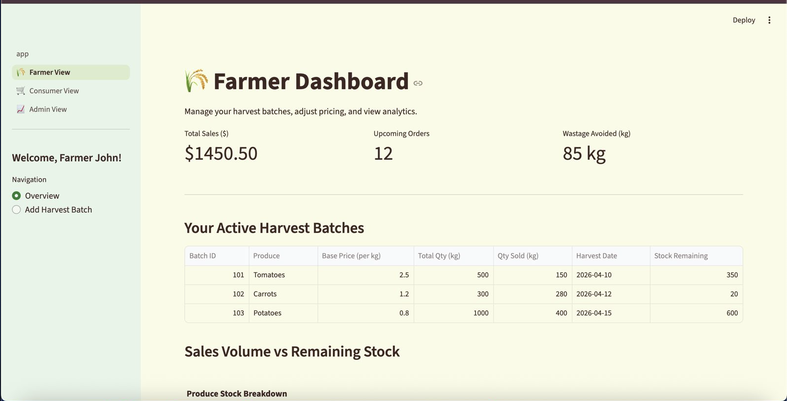
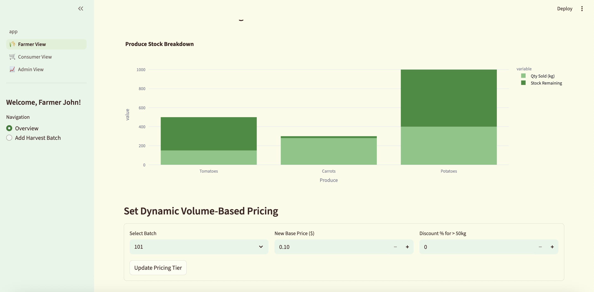
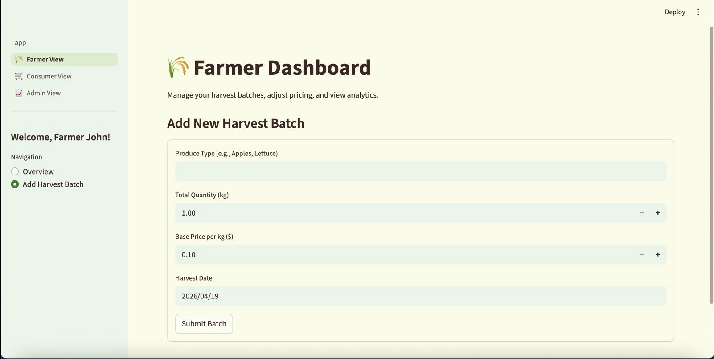
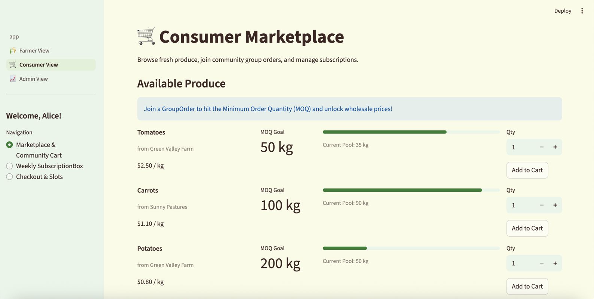
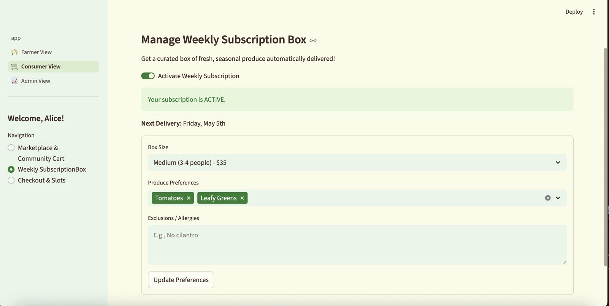
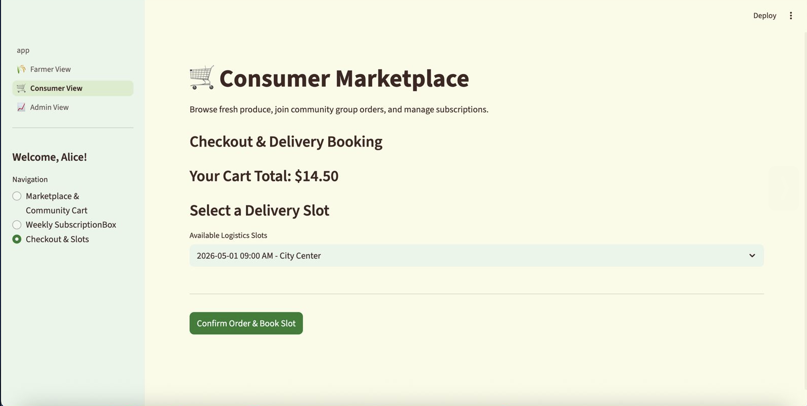
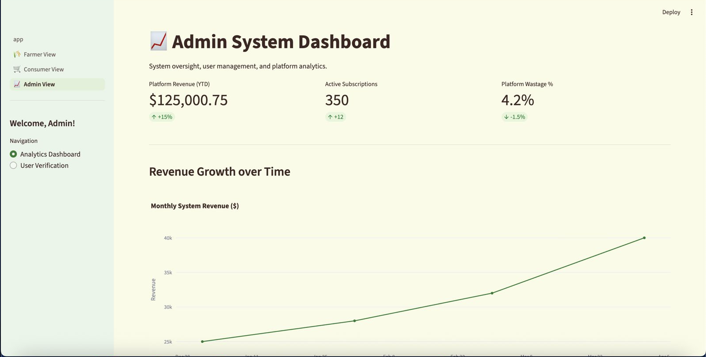
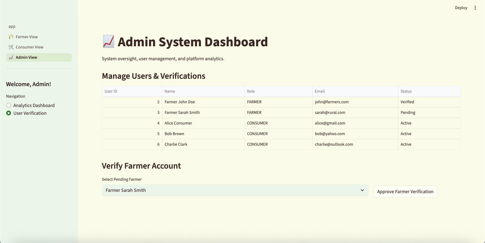
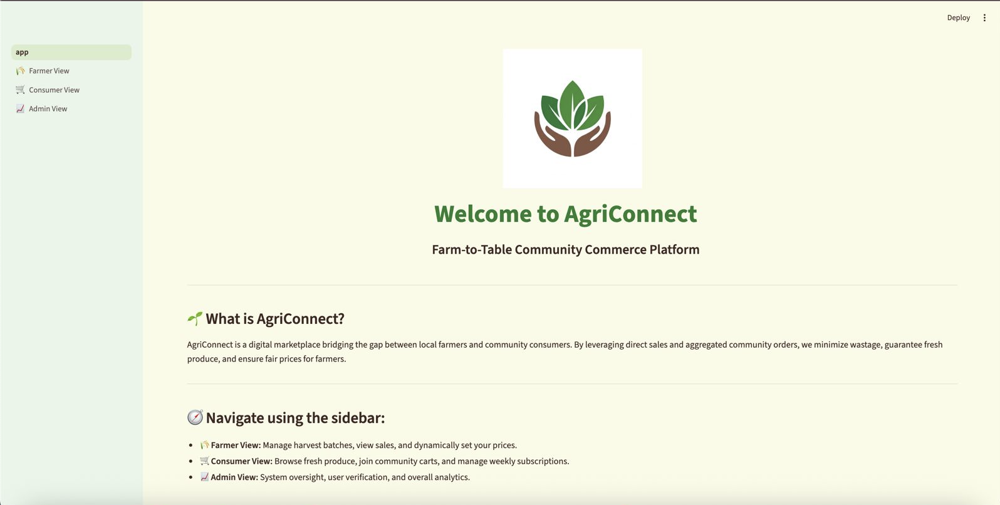

# AgriConnect 🌾
**Farm-to-Table Community Commerce Platform**

AgriConnect is a comprehensive digital marketplace bridging the gap between local farmers and community consumers. By leveraging direct sales and aggregated community orders, we minimize wastage, guarantee fresh produce, and ensure fair prices for farmers.

## 🏗️ Architecture & Tech Stack
- **Backend:** Java (Spring Boot 3.x) with Maven, built on SOLID principles and design patterns (Factory, Observer, Strategy).
- **Database:** MySQL relational DB (Schema includes Farmers, Consumers, GroupOrders, DeliverySlots).
- **Frontend / UI:** Python (Streamlit), adopting a clean earthy theme (`#2E7D32`), fully modularized for Role-Based views.

## 🚀 Quick Setup & Run

### 1. Spring Boot Backend
Ensure you have **Java 17**, **Maven**, and **MySQL** installed. Update your MySQL password in `src/main/resources/application.properties`.
```bash
mvn clean install
mvn spring-boot:run
```
*(Runs on `localhost:8080`)*

### 2. Streamlit UI Frontend
Open a new terminal session.
```bash
cd streamlit_app
pip install -r requirements.txt
streamlit run app.py
```
*(Runs on `localhost:8501`)*

---

## 📸 Application Screenshots

*(Placeholder for 9 screenshots across our 3 role-based views. Add your images to a `docs/` or `assets/` folder and link them below!)*

| Module | Preview 1 | Preview 2 | Preview 3 |
| :--- | :---: | :---: | :---: |
| **Farmer Dashboard** <br>*(Manage batches & dynamic pricing)* |  |  |  |
| **Consumer View** <br>*(Community cart & Weekly box)* |  |  |  |
| **System & Admin** <br>*(Analytics & Oversight)* |  |  |  |
